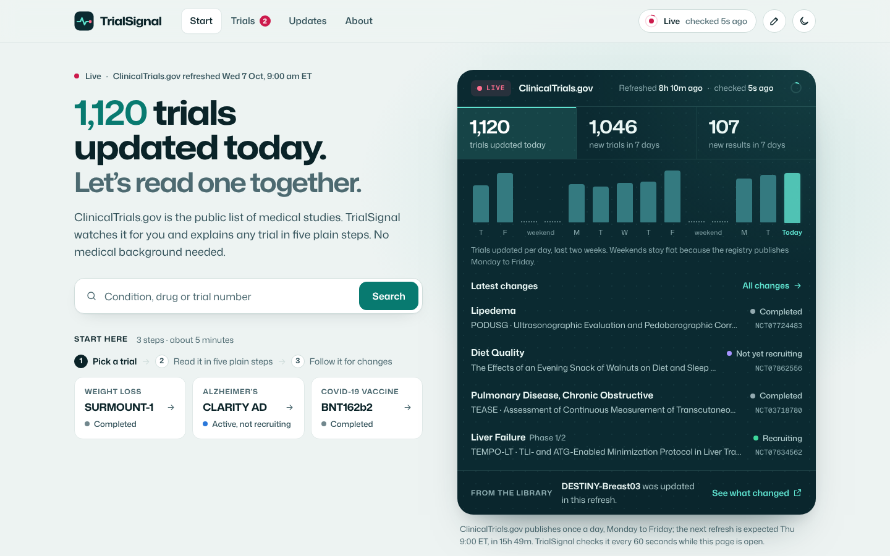
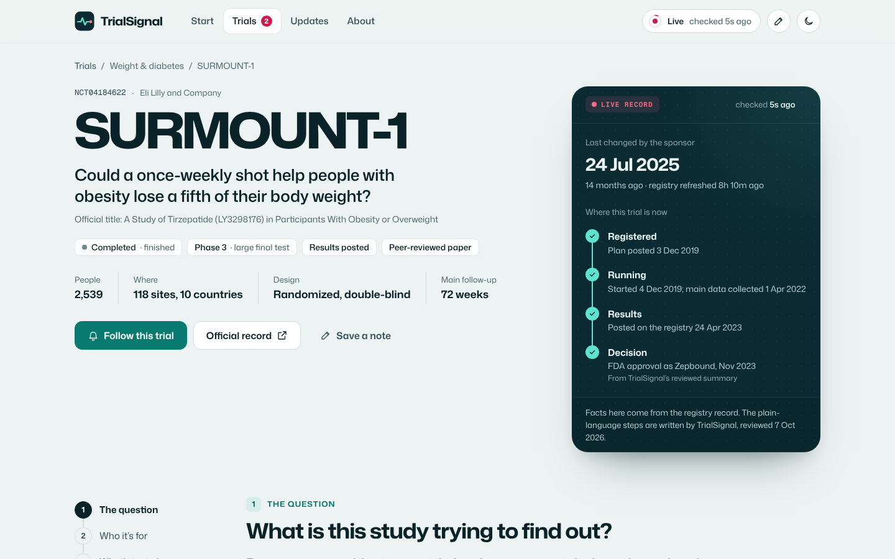
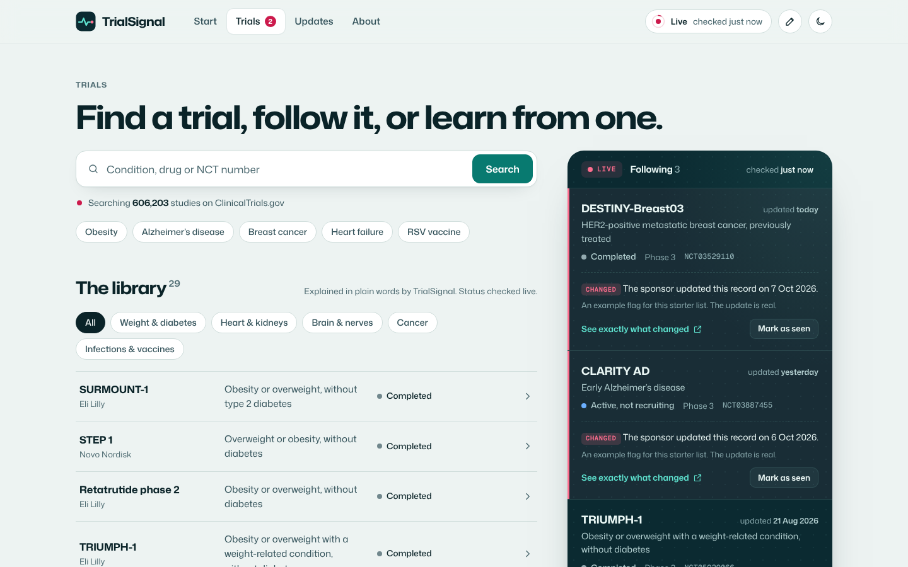
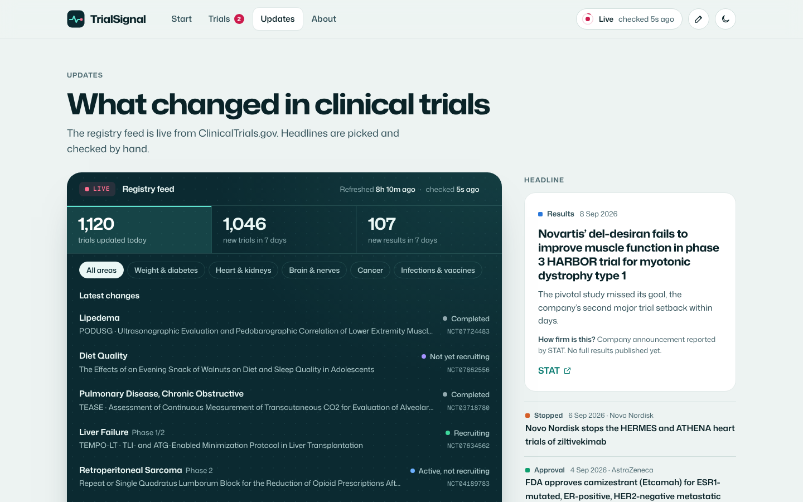
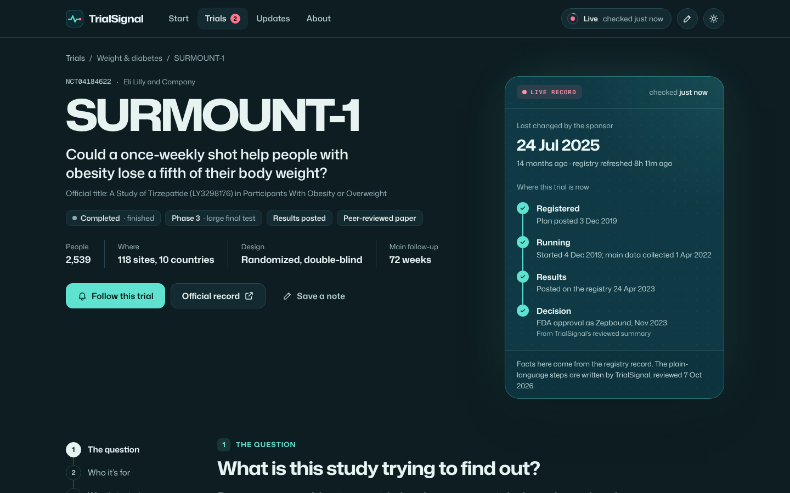
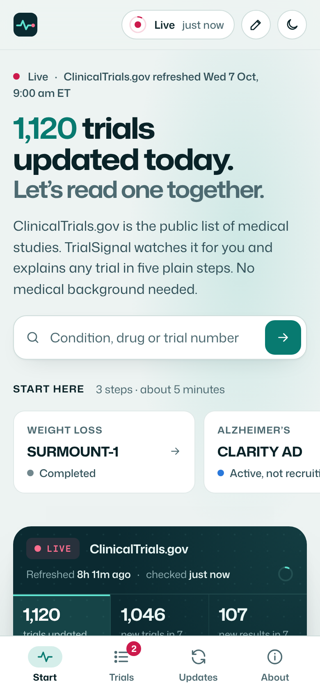

# TrialSignal

Clinical trials, live and in plain words. TrialSignal watches ClinicalTrials.gov and explains any trial in five plain steps, so a first-time reader can follow a study from plan to evidence and keep watching it change.

**Live site:** https://mehtagoral2530.github.io/trialsignal/ (after GitHub Pages is switched on; see [Deploy](#deploy))



## What it does

| | |
|---|---|
| **Feels live because it is** | The Start page leads with a real number (“1,120 trials updated today”), a 14-day activity chart and a stream of the newest registry changes. A dark panel always means live registry data. Clocks tick every second, and a scan line sweeps the panel each time the site checks the registry. |
| **Read any trial in five steps** | The question, who it’s for, what’s tested, how it’s measured, what’s been found. Each trial page adds a plain question, glossed status and phase, jargon explainers, eligibility chips, a 100-dot picture of the real group sizes, and result bars. |
| **Track trials** | Follow any trial. The Following panel flags changes to status, main results date, enrollment, posted results or the record itself, with a link to the registry’s change history. First-time visitors start with three trials; any whose record really changed in the two weeks before the saved copy is flagged as a labelled example. |
| **Search the whole registry** | Live search across more than 600,000 studies. Conditions are searched first (so “Obesity” finds obesity studies), falling back to all text for drug names. Paste a registry link or NCT number to jump straight to the trial. “Recruiting only” and “Newest updates first” narrow the list. |
| **See what changed** | A live registry feed filtered by area, hand-picked headlines labelled by how firm the evidence is, and a side-by-side comparison of any two library trials. |
| **Answers you can check** | The question box answers from the trial’s own record and names the section it came from. No AI, nothing invented. |
| **Notes** | Kept in the browser, with copy and Markdown download. |

| Trial page | Following |
|---|---|
|  |  |
| **Updates** | **Dark mode** |
|  |  |



## How “live” works

ClinicalTrials.gov publishes new data once a day, Monday to Friday, at about 9:00 US Eastern time. TrialSignal is honest about that:

- Every 60 seconds while a page is open (and when you return to the tab) it asks `GET /api/v2/version` for the registry’s `dataTimestamp`. That is the only request on the timer.
- When the timestamp changes, it refetches the counts, the 14-day bars, the feeds and the statuses. New feed rows slide in with a NEW tag, and changed numbers count from their old value.
- Counts are measured against the registry’s own date, never the visitor’s clock, so the headline never says “0 today” on a weekend.
- Nothing moves without a reason: the scan line and logo trace run on real checks only, and rows animate only when they really arrive.

## The library

29 landmark trials across five areas, each with a hand-written summary, a fact-checked plain question, eligibility chips, a plain description of the main measure and a linked publication:

- **Weight & diabetes:** SURMOUNT-1, STEP 1, retatrutide phase 2, TRIUMPH-1, SURPASS-2
- **Heart & kidneys:** SELECT, DAPA-HF, EMPEROR-Reduced, DELIVER, PARADIGM-HF, FOURIER, DAPA-CKD, FLOW
- **Brain & nerves:** CLARITY AD, TRAILBLAZER-ALZ 2, EMERGE, ORATORIO, STRIVE, ENDEAR
- **Cancer:** KEYNOTE-189, KEYNOTE-024, FLAURA, DESTINY-Breast04, DESTINY-Breast03, KEYNOTE-522, CheckMate 067
- **Infections & vaccines:** BNT162b2 (COVID-19), AReSVi-006 (RSV), PURPOSE 1 (HIV prevention)

Every DOI was checked against Crossref, and every eligibility chip and main-measure sentence was checked against the registry text. Registry facts (status, dates, eligibility, outcomes, sites, group sizes) are never typed by hand.

## How it’s built

```
Browser ──GET──▶ ClinicalTrials.gov API v2     /version every 60 s; counts, feeds, records on change
   │
   ├── site/data/library.js    hand-written summaries, citations and plain-language extras
   ├── site/data/snapshot.js   saved copy of the records and the whole pulse, used offline
   └── localStorage            followed trials, notes, theme
```

- **No server, no build, no dependencies.** Plain HTML, CSS and JavaScript modules. The API accepts direct browser requests; requests stay simple GETs with no custom headers because the API rejects CORS preflight.
- **Offline is calm, not broken.** If the registry can’t be reached, every panel switches to the saved copy with “SAVED COPY” badges and absolute dates, and retries every 60 seconds. When the connection is back, cached data is dropped and everything is fetched again, so nothing saved is ever shown as live. A weekly GitHub Action refreshes the saved copy.
- **Accessible by default.** Keyboard focus moves to each page’s heading, the skip link works on every page, glossary hints open on tap, hover or focus, and the registry checks are announced to screen readers only when they matter.

## Run it locally

Requires Node.js 20 or later.

```bash
npm start          # http://localhost:8080
npm test           # unit tests (node:test)
npm run snapshot   # refresh site/data/snapshot.js from ClinicalTrials.gov
npm run preview    # offline copy in dist/preview for sandboxed hosts
```

## Deploy

**GitHub Pages (set up in this repo):**

1. Merge this work into the `main` branch.
2. In the repository, open **Settings → Pages** and set **Source** to **GitHub Actions**.
3. The *Deploy to GitHub Pages* workflow publishes the `site/` folder on every push to `main`. The site appears at `https://mehtagoral2530.github.io/trialsignal/`.

**Netlify or Vercel:** import the repository, leave the build command empty and set the publish (output) directory to `site`.

## Project layout

```
site/
  index.html            the four pages, the trial view, header, phone tab bar
  assets/styles.css     design tokens (light and dark) and components
  js/
    app.js              routing, live chrome, theme, start-up
    live.js             the 60-second check, ticking clocks, count-ups, scan line
    data.js             live data with saved-copy fallback
    api.js              ClinicalTrials.gov client
    console.js          shared pieces of the live panels (bars, feed rows)
    normalize.js        turns API records into the shape the views use
    tracking.js         followed trials and change detection
    ask.js              answers questions from a record
    notes.js, ui.js, util.js, config.js
    views/              start, trials, trial, updates
  data/
    library.js          the 29 curated trials
    news.js             hand-picked headlines
    glossary.js         plain definitions
    snapshot.js         generated saved copy
scripts/                dev server, snapshot builder, preview builder
tests/                  unit tests
.github/workflows/      tests, Pages deploy, weekly snapshot refresh
```

## Updating content

- **Add a library trial:** add an entry to `site/data/library.js`, run `npm run snapshot`, then `npm test`. The tests check every entry is complete and present in the snapshot.
- **Add a headline:** add it to `site/data/news.js` and update `NEWS_REVIEWED`.
- **Author links:** edit `site/js/config.js`. Add your LinkedIn URL there to show it in the footer.

## Scope

TrialSignal is a public-information research tool for learning and orientation. It does not decide whether a treatment is right for anyone, confirm eligibility, rank treatments or replace clinical judgment. Patient matching, site-feasibility assessment and protocol-deviation monitoring were part of the wider concept and are not features of this site.

> TrialSignal is an operational efficiency tool. All data must be verified against the official IRB-approved protocol and investigator brochure before clinical application.

## Credits

Built by Goral Mehta. Trial data from [ClinicalTrials.gov](https://clinicaltrials.gov/), a service of the U.S. National Library of Medicine. Publications are linked to their journals by DOI. The build story is on the site’s About page.
