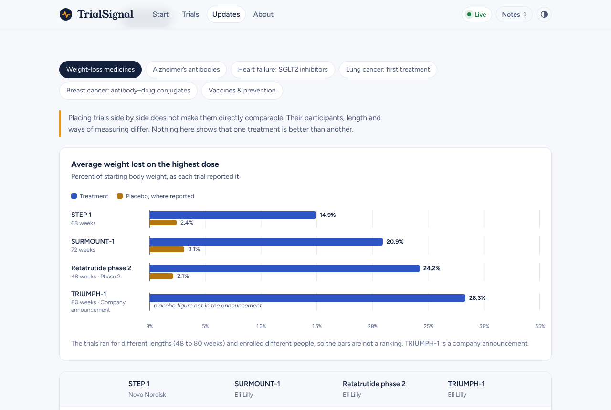

# TrialSignal

A plain-language guide to public clinical trials. Enter a trial number or a topic and TrialSignal walks you through what the study asks, who it is for, what is tested and what has been found. It also tracks the trials you follow live from ClinicalTrials.gov.

**Live site:** https://mehtagoral2530.github.io/trialsignal/ (after GitHub Pages is switched on; see [Deploy](#deploy))


## What it does

| | |
|---|---|
| **Read any trial in five steps** | The question, who it’s for, what’s tested, how it’s measured and what’s been found. Glossary terms are underlined with a short definition. |
| **Track trials live** | Follow any trial. TrialSignal re-checks followed trials against ClinicalTrials.gov when the site opens and every 10 minutes while it is open. It flags changes to status, main results date, enrollment, posted results or the record itself. |
| **Search the whole registry** | Live search across ClinicalTrials.gov with status and order filters. Any trial opens in the same five-step reader. |
| **Know how firm a finding is** | Every result is labelled as a peer-reviewed paper or a company announcement. A four-stage tracker shows where the trial is between registration and a regulatory decision. |
| **See what changed** | A live feed of phase 2 and 3 trials whose records changed in the last 30 days, plus hand-picked headlines on results, approvals, filings and discontinued programs. |
| **Compare side by side** | Six sets of related trials in a table, with a weight-loss chart and a clear warning that side-by-side is not a ranking. |
| **Ask questions** | Answers come from the trial’s own record and name the section they came from. No AI, nothing invented. |
| **Notes** | Kept in the browser, with copy and Markdown download. |

| Trial page | Live tracking |
|---|---|
|  |  |
| **Side by side** | **Dark mode** |
|  |  |


## The library

29 landmark trials across five areas, each with a hand-written plain-language summary and a linked publication:

- **Weight & diabetes:** SURMOUNT-1, STEP 1, retatrutide phase 2, TRIUMPH-1, SURPASS-2
- **Heart & kidneys:** SELECT, DAPA-HF, EMPEROR-Reduced, DELIVER, PARADIGM-HF, FOURIER, DAPA-CKD, FLOW
- **Brain & nerves:** CLARITY AD, TRAILBLAZER-ALZ 2, EMERGE, ORATORIO, STRIVE, ENDEAR
- **Cancer:** KEYNOTE-189, KEYNOTE-024, FLAURA, DESTINY-Breast04, DESTINY-Breast03, KEYNOTE-522, CheckMate 067
- **Infections & vaccines:** BNT162b2 (COVID-19), AReSVi-006 (RSV), PURPOSE 1 (HIV prevention)

Every publication DOI was checked against Crossref. Registry facts (status, dates, eligibility, outcomes, sites) are never typed by hand: they come from ClinicalTrials.gov.

## How it works

```
Browser ──GET──▶ ClinicalTrials.gov API v2      (search, records, change checks)
   │
   ├── site/data/library.js    hand-written summaries + citations
   ├── site/data/snapshot.js   saved registry copy, used offline
   └── localStorage            followed trials, notes, theme
```

- **No server.** The ClinicalTrials.gov API accepts requests straight from the browser, so the site is plain static files. Requests stay simple GETs with no custom headers, because the API rejects CORS preflight requests.
- **No build step and no dependencies.** HTML, CSS and plain JavaScript modules.
- **Offline fallback.** If the registry can’t be reached, the library still works from `snapshot.js`. A weekly GitHub Action refreshes it.
- **Tracking without accounts.** Followed trials are stored in the reader’s browser. The trade-off is that checks only run while the site is open.

## Run it locally

Requires Node.js 20 or later.

```bash
npm start          # http://localhost:8080
npm test           # unit tests (node:test)
npm run snapshot   # refresh site/data/snapshot.js from ClinicalTrials.gov
npm run preview    # offline copy in dist/preview for sandboxed hosts
```

## Deploy

**GitHub Pages (set up in this repo):**

1. Merge this work into the `main` branch.
2. In the repository, open **Settings → Pages** and set **Source** to **GitHub Actions**.
3. The *Deploy to GitHub Pages* workflow publishes the `site/` folder on every push to `main`. The site appears at `https://mehtagoral2530.github.io/trialsignal/`.

**Netlify or Vercel:** import the repository, leave the build command empty and set the publish (output) directory to `site`.

## Project layout

```
site/
  index.html            all four pages plus the trial view and build story
  assets/styles.css     design tokens, light and dark themes
  js/
    app.js              routing, header, theme, start-up
    api.js              ClinicalTrials.gov client
    normalize.js        turns API records into the shape the views use
    tracking.js         followed trials and change detection
    ask.js              answers questions from a record
    state.js, ui.js, notes.js, util.js, config.js
    views/              start, trials, trial, updates
  data/
    library.js          the 29 curated trials, presets and start-page picks
    news.js             hand-picked headlines
    glossary.js         definitions used for hints and the About page
    snapshot.js         generated registry copy
scripts/                dev server, snapshot builder, preview builder
tests/                  unit tests
.github/workflows/      tests, Pages deploy, weekly snapshot refresh
```

## Updating content

- **Add a library trial:** add an entry to `site/data/library.js`, run `npm run snapshot`, then `npm test`. The tests check that every entry is complete and present in the snapshot.
- **Add a headline:** add it to `site/data/news.js` and update `NEWS_REVIEWED`.
- **Author links:** edit `site/js/config.js`. Add your LinkedIn URL there to show it in the footer.

## Scope

TrialSignal is a public-information research tool for learning and orientation. It does not decide whether a treatment is right for anyone, confirm eligibility, rank treatments or replace clinical judgment. Patient matching, site-feasibility assessment and protocol-deviation monitoring were part of the wider concept and are not features of this site.

> TrialSignal is an operational efficiency tool. All data must be verified against the official IRB-approved protocol and investigator brochure before clinical application.

## Credits

Built by Goral Mehta. Trial data from [ClinicalTrials.gov](https://clinicaltrials.gov/), a service of the U.S. National Library of Medicine. Publications are linked to their journals by DOI. Read the build story on the site’s About page.
